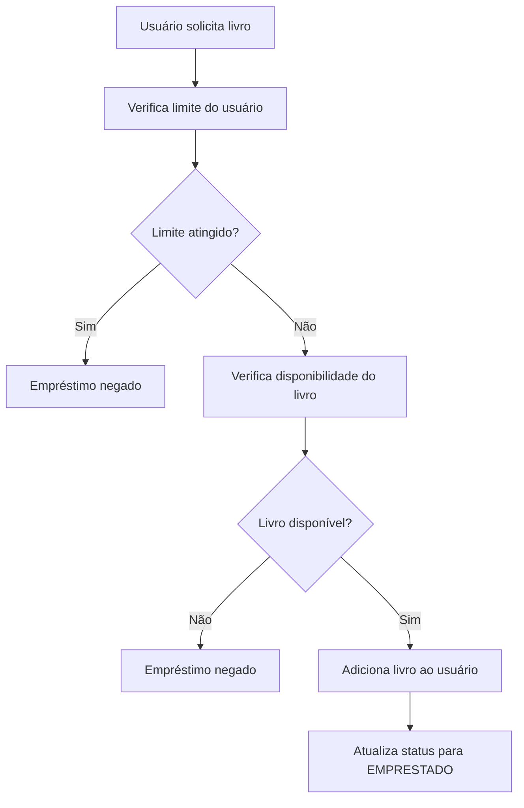
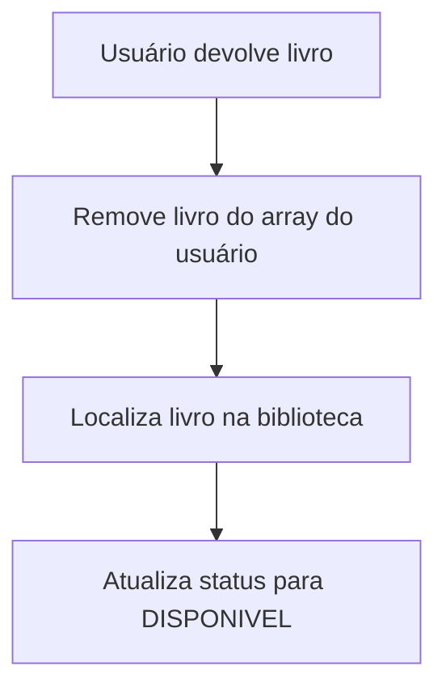

# 📚 Library Management System

Sistema de gerenciamento de biblioteca desenvolvido em **Java SE**, com foco em boas práticas de Programação Orientada a Objetos, modelagem de domínio e arquitetura em camadas.

---

## 🚀 Funcionalidades

| Funcionalidade | Status |
|---|---|
| Cadastro de livros com validação de limite | ✅ |
| Cadastro de usuários com validação de limite | ✅ |
| Empréstimo de livros | ✅ |
| Devolução de livros | ✅ |
| Controle de disponibilidade via Enum | ✅ |
| Validação de limite de empréstimos por tipo de usuário | ✅ |
| Validação de livro já emprestado | ✅ |
| Diferentes tipos de usuário (Aluno, Professor, Bibliotecário) | ✅ |
| Menu interativo no console | ✅ |
| Busca de usuário por CPF | ✅ |
| Busca de livro por título | ✅ |

---

## 🛠️ Tecnologias

- **Java SE** — linguagem principal
- **IntelliJ IDEA** — IDE utilizada no desenvolvimento
- **Git & GitHub** — versionamento e gerenciamento do projeto

---

## 📂 Estrutura do projeto

```bash
src/
 └── main/
      └── java/
           ├── app/         → ponto de entrada da aplicação
           ├── domain/      → entidades do sistema (Usuario, Livro, Biblioteca)
           ├── service/     → regras de negócio e validações
           └── enums/       → StatusLivro e Type (tipos de usuário)
```

---

## 🧠 Conceitos aplicados

- **Programação Orientada a Objetos**
- **Herança e Classes Abstratas**
- **Encapsulamento**
- **Enums com atributos e métodos**
- **Arquitetura em camadas**
- **Modelagem de domínio**
- **Regras de negócio separadas em camada de serviço**
- **Validações de limite e disponibilidade**
- **Constantes estáticas para eliminar magic numbers**
- **Gerenciamento manual de coleções com arrays**

---

## 📖 Entidades

### 📘 Livro

Representa um livro dentro da biblioteca.

```java
private String titulo;
private String autor;
private int paginas;
private StatusLivro status;
```

Responsabilidades:
- armazenar informações do livro
- controlar disponibilidade via `StatusLivro`

---

### 👤 Usuario (Abstract)

Classe base para todos os tipos de usuário.

```java
private String nome;
private String CPF;
private Type type;
private int MAX_LIVROS;
private Livro[] livros;
```

Responsabilidades:
- armazenar dados comuns de qualquer usuário
- gerenciar livros emprestados
- definir o contrato de tipo via método abstrato

Tipos concretos:

| Tipo | Limite de livros |
|---|---|
| Aluno | 5 |
| Professor | 10 |
| Bibliotecário | 15 |

---

### 🏛️ Biblioteca

Representa o núcleo da biblioteca.

```java
private static final int MAX_USERS = 500;
private static final int MAX_BOOKS = 1500;
private Usuario[] usuarios;
private Livro[] livros;
```

Responsabilidades:
- armazenar usuários e livros com limites definidos
- centralizar os dados do sistema

---

## 🔄 Fluxo de empréstimo



---

## 🔄 Fluxo de devolução



---

## 📌 Enums

```java
public enum StatusLivro {
    DISPONIVEL,
    EMPRESTADO
}

public enum Type {
    ALUNO("Aluno"),
    PROFESSOR("Professor"),
    BIBLIOTECARIO("Bibliotecario");
}
```

---

## 🎯 Objetivo do projeto

Praticar e demonstrar:
- modelagem de sistemas reais com Java
- herança e classes abstratas aplicadas a domínio concreto
- separação de responsabilidades entre camadas
- validações e regras de negócio
- boas práticas com constantes, enums e encapsulamento

---

## 🚧 Próximos passos

- [ ] Migrar arrays para `ArrayList`
- [ ] Persistência de dados com JDBC + MySQL
- [ ] API REST com Spring Boot

---

## 📄 Licença

Este projeto está sob a licença MIT.

---

## 👨‍💻 Autor

Desenvolvido por **Alevir Coelho Neto**

[](https://github.com/alevir-dev)
[](https://linkedin.com/in/alevir-coelho-neto)
