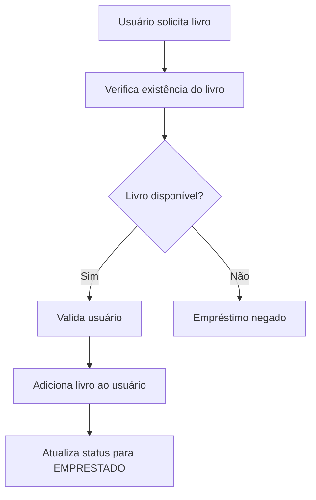

# 📚 Library Management System

Sistema de gerenciamento de biblioteca desenvolvido em **Java SE**, com foco em boas práticas de Programação Orientada a Objetos, modelagem de domínio e arquitetura em camadas.

---

## 🚀 Funcionalidades

| Funcionalidade | Status |
|---|---|
| Cadastro de livros | ✅ |
| Cadastro de usuários | ✅ |
| Empréstimo de livros | ✅ |
| Devolução de livros | ✅ |
| Controle de disponibilidade | ✅ |
| Validação de usuários e livros | ✅ |
| Listagem de livros por usuário | ✅ |
| Controle de status via Enum | ✅ |

---

## 🛠️ Tecnologias

- **Java SE** — linguagem principal
- **IntelliJ IDEA** — IDE utilizada no desenvolvimento
- **Git & GitHub** — versionamento e gerenciamento do projeto

---

## 📂 Estrutura do projeto

```bash
src/
 └── main/
      └── java/
           ├── app/         → ponto de entrada da aplicação
           ├── domain/      → entidades do sistema
           ├── service/     → regras de negócio e validações
           └── enums/       → estados e enums do sistema
```

---

## 🧠 Conceitos aplicados

- **Programação Orientada a Objetos**
- **Encapsulamento**
- **Enums**
- **Arquitetura em camadas**
- **Modelagem de domínio**
- **Regras de negócio separadas em camada de serviço**
- **Validações**
- **Gerenciamento manual de coleções com arrays**

---

## 📖 Entidades

### 📘 Livro

Representa um livro dentro da biblioteca.

```java
private String titulo;
private String autor;
private int paginas;
private StatusLivro status;
```

Responsabilidades:
- armazenar informações do livro
- controlar disponibilidade
- representar um item da biblioteca

---

### 👤 Usuario

Representa um usuário cadastrado na biblioteca.

```java
private String nome;
private String CPF;
private Livro[] livrosEmprestados;
```

Responsabilidades:
- armazenar dados do usuário
- gerenciar livros emprestados

---

### 🏛️ Biblioteca

Representa o núcleo da biblioteca, armazenando usuários e livros cadastrados.

```java
private Livro[] livros;
private Usuario[] usuarios;
```

Responsabilidades:
- armazenar usuários
- armazenar livros
- centralizar os dados do sistema

---

## 🔄 Fluxo de empréstimo



---

## 📌 Status dos livros

```java
public enum StatusLivro {
    DISPONIVEL,
    EMPRESTADO
}
```

O sistema utiliza Enum para controlar os estados possíveis dos livros durante o fluxo de empréstimo e devolução.

---

## 🎯 Objetivo do projeto

Este projeto foi desenvolvido com o objetivo de praticar:

- lógica de programação
- organização de código
- arquitetura orientada a objetos
- separação de responsabilidades
- modelagem de sistemas reais
- validações e regras de negócio
- boas práticas com Java

---

## 🚧 Próximos passos

- [ ] Implementar menu interativo no console
- [ ] Adicionar busca de livros
- [ ] Adicionar busca de usuários
- [ ] Limite de empréstimos por usuário
- [ ] Migrar arrays para `ArrayList`
- [ ] Persistência de dados com JDBC + MySQL
- [ ] API REST com Spring Boot

---

## 📄 Licença

Este projeto está sob a licença MIT.

---

## 👨‍💻 Autor

Desenvolvido por **Alevir Coelho Neto**

[](https://github.com/alevir-dev)
[](https://linkedin.com/in/alevir-coelho-neto)
